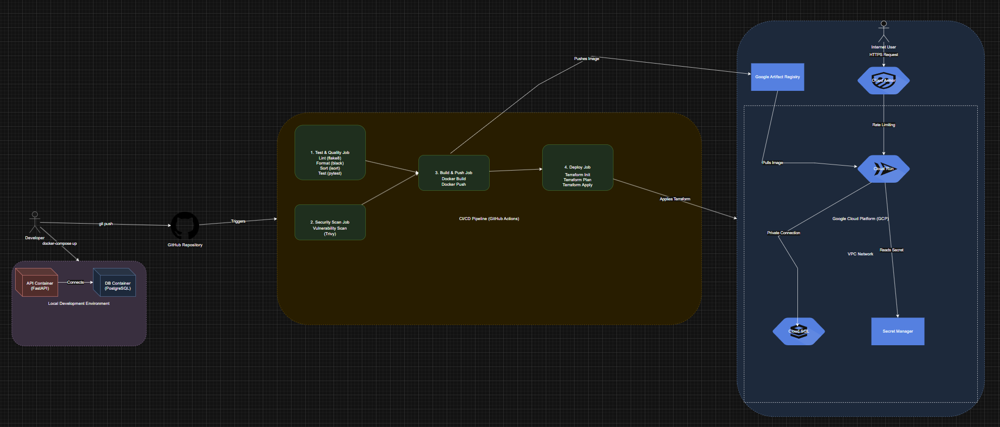
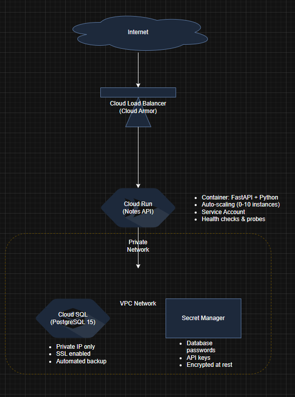

# D&T Cloud Engineer Assignment

This document outlines the project structure, local setup, cloud architecture, and CI/CD pipeline for the Notes API application.

## 1. Application

### Local Setup

**Prerequisites:**
- Docker and Docker Compose
- Git

**Steps:**

1.  **Clone the repository**
2.  **Start the application:**
    ```sh
    docker-compose up -d
    ```
3.  **Verify the services are running:**
    ```sh
    docker-compose ps
    ```
4.  **Access the API:**
    - **API Base URL:** `http://localhost:8000`
    - **Interactive API Docs:** `http://localhost:8000/docs`

### API Usage

#### Endpoints

##### Create a Note
```sh
curl -X POST "http://localhost:8000/notes" \
     -H "Content-Type: application/json" \
     -d '{
       "title": "My First Note",
       "content": "This is the content of my first note"
     }'
```

##### Get All Notes
```sh
curl -X GET "http://localhost:8000/notes"
```

##### Get a Specific Note
```sh
curl -X GET "http://localhost:8000/notes/1"
```

##### Update a Note
```sh
curl -X PUT "http://localhost:8000/notes/1" \
     -H "Content-Type: application/json" \
     -d '{
       "title": "Updated Note Title",
       "content": "Updated content"
     }'
```

##### Delete a Note
```sh
curl -X DELETE "http://localhost:8000/notes/1"
```

#### Example Response
```json
{
  "id": 1,
  "title": "My First Note",
  "content": "This is the content of my first note",
  "created_at": "2025-09-05T10:30:00Z",
  "updated_at": "2025-09-05T10:30:00Z"
}
```

#### Running test inside container

-   **Run tests:**
    ```sh
    docker exec notes_api pytest tests/ -v
    ```

#### Code Quality
-   **Install tools:**
    ```sh
    docker exec notes_api pip install black isort flake8
    ```

-   **Format code:**
    ```sh
    docker exec notes_api black app/
    ```
-   **Sort imports:**
    ```sh
    docker exec notes_api isort app/
    ```
-   **Lint code:**
    ```sh
    docker exec notes_api flake8 app/
    ```

### Project Structure


---

## 2. Cloud Infrastructure Design

### Cloud Architecture (GCP)


### Security Features
-   **Network Security:** Private VPC with no public IPs for the database.
-   **Identity & Access Management:** Service accounts with minimal permissions (least privilege).
-   **Secrets Management:** Database credentials stored in Google Secret Manager.
-   **SSL/TLS:** End-to-end encryption for data in transit.
-   **Rate Limiting:** Google Cloud Armor for protection against DDoS and other web attacks.
-   **Container Security:** Vulnerability scanning with Trivy integrated into the CI/CD pipeline.

### Design Choices & Justifications

#### Cloud Compute Service: Cloud Run
-   **Justifications:**
    -   **Serverless:** Pay-per-use model that scales to zero, optimizing costs.
    -   **Fully Managed:** No infrastructure management overhead.
    -   **Container-Native:** Enables direct deployment from Docker containers.
    -   **Auto-scaling:** Automatically handles traffic spikes (configured for 0-10 instances).
    -   **Cost-Effective:** Ideal for applications with variable or intermittent workloads.
    -   **Fast Cold Starts:** Optimized for stateless, request-response driven applications.
-   **Alternatives Considered:**
    -   `GKE:` Overkill for a simple API, introducing higher operational complexity.
    -   `Compute Engine:` Requires manual scaling, patching, and maintenance.
    -   `App Engine:` Less flexible for custom containerized applications.

#### Database: Cloud SQL (PostgreSQL)
-   **Justifications:**
    -   **Fully Managed:** Automates backups, updates, and maintenance.
    -   **ACID Compliance:** Ensures data consistency and transactional integrity.
    -   **Performance:** Optimized for transactional workloads.
    -   **Security:** Supports Private IP, SSL encryption, and IAM database authentication.
    -   **Scalability:** Allows for vertical scaling as the workload grows.

#### Identity & Access Management
-   **Service Accounts:** Adheres to the principle of least privilege by assigning specific roles.
-   **IAM Roles:** Granular permissions are assigned (e.g., `cloudsql.client`, `secretmanager.secretAccessor`).
-   **No Default Credentials:** Explicit service account assignment to resources.

#### Secrets Management
-   **Secret Manager:** Provides encrypted, centralized storage for sensitive data like API keys and database credentials.
-   **Environment Variables:** Securely injects secrets into containers at runtime.
-   **Rotation:** Supports automated credential rotation policies.
-   **Access Logging:** Audits and logs all access to secrets.

#### Application Security
-   **Container Scanning:** Trivy detects vulnerabilities in the container image during the CI pipeline.
-   **SSL/TLS:** Enforces end-to-end encryption.
-   **Input Validation:** Pydantic models validate incoming request data.
-   **Error Handling:** Provides secure error responses without leaking sensitive information.

### Trade-offs & Alternatives

| Aspect                  | Current Implementation                               | Alternative                                        | Trade-off                                                      |
| ----------------------- | ---------------------------------------------------- | -------------------------------------------------- | -------------------------------------------------------------- |
| **Cost vs. Performance**| Cloud Run (pay-per-use) + Cloud SQL (small instance) | Preemptible GKE cluster                            | Chose simplicity and managed services over cost optimization.  |
| **Availability vs. Cost** | Single-zone deployment                               | Multi-zone with read replicas                      | Balanced cost with acceptable availability for a demo project. |
| **Security vs. Accessibility** | Public API with rate limiting                        | API Gateway with authentication (e.g., API Keys) | Chose open accessibility for the demo over stricter access control. |

### Monitoring & Observability

-   **Built-in Monitoring:**
    -   **Cloud Run Metrics:** Request rate, latency, error rate.
    -   **Cloud SQL Monitoring:** Connection count, CPU usage, disk I/O.
    -   **Health Checks:** Startup and liveness probes for container health.
-   **Additional Tooling to Consider:**
    -   **Cloud Monitoring:** For custom metrics and alerting.
    -   **Cloud Logging:** For centralized log aggregation and analysis.
    -   **Error Reporting:** For automatic error detection and grouping.
    -   **Cloud Trace:** For distributed tracing to analyze performance bottlenecks.

---

## 3. DevOps - CI/CD Pipeline Design

### CI/CD Tool: GitHub Actions
-   **Justifications:**
    -   **Integrated:** Native integration with the GitHub repository.
    -   **Cost-Effective:** Generous free tier for public repositories.
    -   **Flexibility:** Supports custom workflows, reusable actions, and third-party integrations.
    -   **Security:** Includes built-in secrets management and security scanning features.

### Pipeline Stages
1.  **Code Quality:** Linting (`flake8`), formatting (`black`), and import sorting (`isort`).
2.  **Testing:** Run unit tests with `pytest` and generate coverage reports.
3.  **Security:** Scan the Docker image for vulnerabilities using `Trivy`.
4.  **Build:** Build the Docker image and push it to Google Artifact Registry.
5.  **Infrastructure:** Deploy infrastructure changes using Terraform with remote state management in Google Cloud Storage.
6.  **Deploy:** Deploy the new container image to Cloud Run.

---

## 4. Additional Considerations

-   **Multiple Environments:** For a production-grade system, setting up multiple environments (e.g., dev, staging, prod) is crucial. This would isolate development and testing from the production environment and should be managed by Terraform with separate state files for each environment.
-   **High Availability:** For critical applications, a multi-region deployment would provide higher availability and resilience against regional outages.
-   **Semantic Versioning:** Automate versioning within the CI/CD pipeline and generate changelogs based on commit messages using tools like `semantic-release`.
-   **Enhanced Workflow:** Implement a Gitflow-style workflow where deployments to staging happen from the `develop` branch, and a manual approval/code review is required before deploying to production from the `main` branch.
-   **Deployment Strategies:** Utilize advanced deployment strategies like canary or blue-green deployments to enable zero-downtime releases and safe rollbacks in Cloud Run.
-   **Disaster Recovery:** A disaster recovery (DR) plan should be designed to restore or roll back the application and its data to a previous state in case of a major failure.
-   **Cloud Exit Plan:** An exit strategy could be developed to migrate all resources from GCP to another cloud provider (e.g., AWS, Azure) if required by business needs or compliance.
-   **Terraform code:** The terraform code could be more modular, could use more variables for parameters (for eg. the bucket name for the tfstate file is hardcoded as of right now)
-   **More options for the CI/CD pipeline:** Seperate pipeliens for the application code and IaC would be beneficial. The pipeline for terraform could support multiple modes (such as only planning, applying (terraform plan + apply), testing (terraform plan+apply+destroy) and destroy option). Variables for the pipeline could be supplemented from another repository (variables for terraform deployer account, authentication etc.)

---

## Disclaimer
The CI/CD and Terraform code in this repository are provided as a proof-of-concept. They have not been fully tested and may contain errors.